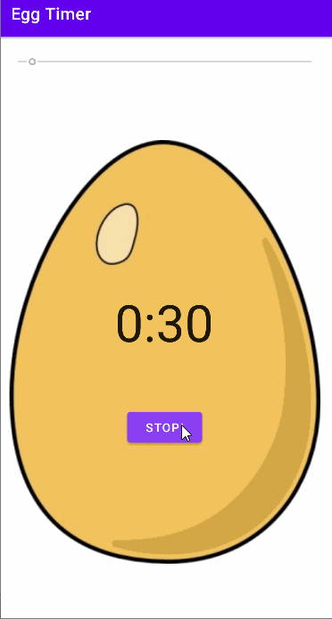

# Egg_Timer

**Egg Timer** is an easy timer for Android system.
Submitted by: **Lu He**
Time spent: **0.5** hours spent in total

## Technologies Used 
Android Studio, Java

## Direction
1. Moving the seekbar to the time you want to start with
2. Clicking the button, and the Timer would countdown the time
3. If clicking the button again, it would stop and reset the time to 0:30
4. If the time hit 0:00, it would have a horn sound to notify the user

## Video Walkthrough

GIF created with [LiceCap](http://www.cockos.com/licecap/).

Either of this status would end the game, and a **PLAY AGAIN** button and report text would appears.

